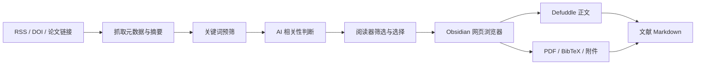
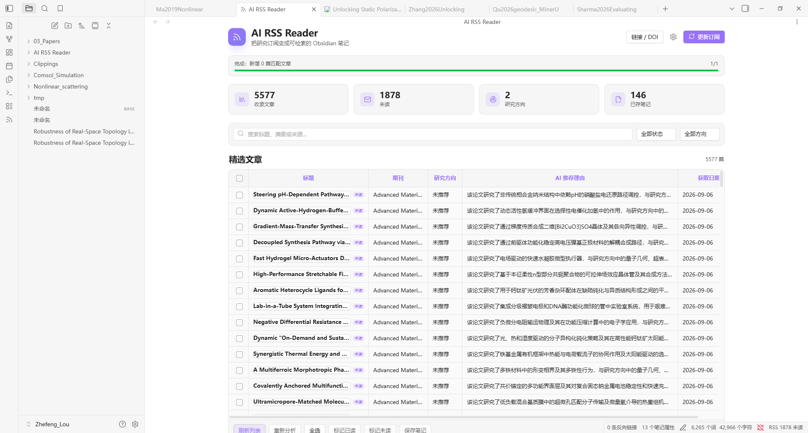
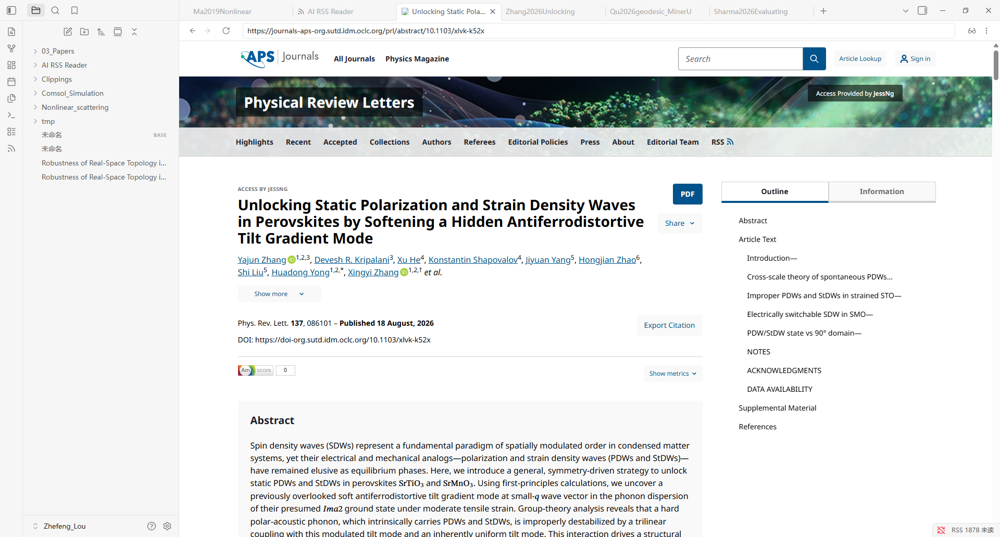
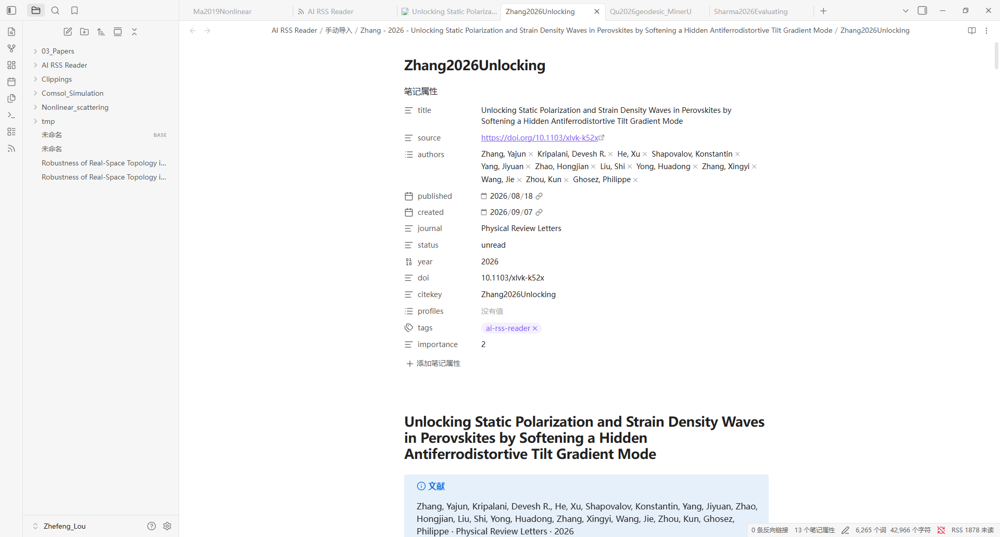

# AI RSS Reader 使用教程

AI RSS Reader 用来在 Obsidian 中完成一条完整的研究阅读流水线：订阅期刊 RSS、按研究方向筛选论文、阅读网页、保存全文与附件，并把 Markdown、BibTeX 和 PDF 整理到同一个文献文件夹中。

> [!tip] 最短上手路线
> 安装插件 → 配置 AI 服务商 → 添加 RSS 源和研究方向 → 点击“更新订阅” → 点击论文标题 → 确认页面加载完成后点击“开始抓取”。



## 1. 安装与启用

本插件仅支持 Obsidian 桌面版，需要 Obsidian 1.5.0 或更高版本。若要使用机构代理，建议使用支持核心插件“网页浏览器（Web viewer）”的 Obsidian 1.8.3 或更高版本。

### 从源码安装

1. 在项目目录运行 `npm install`。
2. 运行 `npm run build`。
3. 在仓库的 `.obsidian/plugins/` 下创建 `ai-rss-reader` 文件夹。
4. 把 `main.js`、`manifest.json`、`styles.css` 复制到该文件夹。
5. 打开“设置 → 第三方插件”，重新加载并启用 **AI RSS Reader**。
6. 如果需要抓取网页正文或使用 EZProxy，再到“设置 → 核心插件”启用 **网页浏览器**。

插件启用后，可以点击左侧 Ribbon 的 RSS 图标，或在命令面板运行“AI RSS Reader：打开阅读器”。

## 2. 首次配置

点击阅读器右上角的齿轮，进入“设置 → AI RSS Reader”。建议按照下面的顺序配置。

### 2.1 选择 AI 服务商

插件支持 ChatGPT Plus/Pro（Codex）、OpenAI API、DeepSeek、Google Gemini、Ollama 和自定义 OpenAI 兼容接口。

| 使用场景 | 建议配置 |
| --- | --- |
| 已有 ChatGPT Plus/Pro，且本机装有 Codex | 选择“ChatGPT Plus/Pro (Codex)”；Codex 命令通常保持 `codex`；登录后选择模型，或跟随 Codex 默认模型 |
| 使用 OpenAI Platform | 选择 OpenAI，填写 API Key、模型和 API 地址 |
| 使用 DeepSeek 或 Gemini | 选择对应服务商，填写 API Key 和模型 |
| 使用本地模型 | 选择 Ollama，确认本地服务地址和模型名正确 |
| 使用其他兼容服务 | 选择自定义 OpenAI 兼容接口，填写 Base URL、Key 和模型 |

> [!warning] 订阅与 API 是两套计费方式
> ChatGPT Plus/Pro（Codex）使用 ChatGPT 订阅配额；OpenAI 服务商使用 Platform API Key 并按 API 用量计费。

> [!warning] 不要分享插件数据文件
> API Key、MinerU Token 和 EZProxy 会话信息保存在当前仓库的 `.obsidian/plugins/ai-rss-reader/data.json`。不要公开、提交或分享这个文件。Codex OAuth 令牌由本机 Codex 管理，不写入插件数据。

### 2.2 添加 RSS 源

在设置页的“RSS 来源”区域点击“添加 RSS 源”，填写：

- 名称：用于阅读器显示和输出文件夹命名，例如 `Nature Physics`。
- URL：RSS 或 Atom 地址。
- 启用：关闭后暂时不抓取，但配置仍保留。

添加后点击“检测所有 RSS 源”。结果窗口会分别显示正常、空订阅或具体错误。建议先确认所有来源可访问，再开始大量抓取。

### 2.3 添加研究方向

在“研究方向”区域点击“添加研究方向”。

- 名称要短而明确，例如“量子几何”。
- 描述要写出主题、方法、材料体系和关键词；中英文关键词都可以写。
- 不要只写一个宽泛名词，否则 AI 推荐理由会过于泛化。

示例：

```text
关注量子几何、Berry curvature、quantum metric 及其在拓扑材料、
莫尔体系和非线性输运中的实验或理论研究；排除纯经典几何算法。
```

可以建立多个方向，并单独启用或停用。一次 AI 请求会同时判断文章与所有已启用方向的相关性。

### 2.4 建议的处理与输出配置

| 设置 | 初次使用建议 | 说明 |
| --- | --- | --- |
| 关键词预筛 | 开启 | 先过滤明显无关文章，减少 AI 调用 |
| 保留不匹配文章 | 开启 | 初次调试方向描述时便于检查漏判；稳定后可关闭 |
| 每个源最多文章数 | 20–50 | 首次测试不要一次导入太多历史文章 |
| 每批 AI 分析数 | 3–8 | 小上下文模型使用 3–5 |
| 已读/未读保留天数 | 30 / 90 | `0` 表示永久保留；只清理阅读器记录，不删除文献文件 |
| 使用 Defuddle 提取正文 | 开启 | 把网页主体转换为 Markdown |
| 保存 BibTeX | 开启 | 优先下载，失败时按元数据生成 |
| 尝试下载 PDF | 按需开启 | 只下载公开或当前账号有权访问的 PDF |
| 单篇保存后打开笔记 | 开启 | 方便立刻检查采集结果 |

默认输出结构如下：

```text
AI RSS Reader/
└── RSS 名称/
    └── 第一作者 - 年份 - 标题/
        ├── Citekey.md
        ├── Citekey.bib
        ├── Citekey.pdf
        └── 补充材料或同行评审附件
```

## 3. 更新订阅与认识阅读器

打开 AI RSS Reader 后，点击右上角“更新订阅”。插件会依次抓取 RSS、执行关键词预筛并调用 AI。顶部进度条会显示当前阶段与数量。



主界面从上到下分为四部分：

1. 工具区：“链接 / DOI”、设置和“更新订阅”。
2. 统计卡片：收录文章、未读、研究方向和已保存笔记。
3. 搜索与筛选：搜索标题、摘要或来源，并按已读状态、研究方向筛选。
4. 文章表格：显示标题、期刊、研究方向、AI 推荐理由和获取日期。

> [!info] 标题和其他单元格的行为不同
> 点击论文标题会打开网页并自动标记为已读；点击标题以外的单元格会选中该条目。表头复选框可以全选当前筛选结果。

表格底部提供以下批量操作：

- 刷新列表：重新按当前条件渲染，不重新抓 RSS。
- 重新分析：让 AI 重新判断所选文章。
- 标记已读 / 标记未读：批量改变阅读状态。
- 保存笔记：按当前选中顺序自动采集并保存。

列与列之间的分隔线可以拖动；宽度会自动保存。插件也会记住列表滚动位置。

## 4. 保存一篇 RSS 论文

### 4.1 打开论文

点击文章标题。插件会：

1. 将文章标记为已读。
2. 在 Obsidian 内置网页浏览器中打开论文页面；已有同一页面标签时会复用。
3. 在网页顶部显示采集状态、“开始抓取”和“取消”。

先等待标题、摘要、正文、公式和附件入口加载完整。如果页面要求机构登录，先完成登录；确认看到目标论文后再点击“开始抓取”。如果插件提示当前地址与目标论文不匹配，但你已人工确认页面确实是目标文献，可点击随后出现的“确认正确，继续抓取”覆盖本次地址校验；机构登录页和图书馆提示页仍会被拒绝。



> [!danger] 不要抓取登录页
> 如果当前显示的是机构登录页、图书馆提示页或另一篇文章，不要点击“开始抓取”。插件会尽量识别并拒绝错误页面，但人工确认仍然最可靠。

### 4.2 检查保存结果

单篇采集成功后，默认会打开生成的 Markdown。上方是 Obsidian Properties，下方是正文、AI 分析、文件链接和采集提示。



建议检查：

- `title`、`authors`、`published`、`journal`、`doi` 是否正确。
- 正文标题和摘要是否属于目标论文。
- “文件”章节中的 PDF、BibTeX 和附件链接是否存在。
- 是否出现“采集提示” Callout；其中会说明正文、PDF 或附件的局部失败。

某个文件下载失败不会阻止其他内容保存。PDF 是否可得取决于公开权限或当前机构账号授权。

## 5. 批量保存

1. 在表格中点击标题之外的单元格，选中多篇文章。
2. 点击底部“保存笔记”。
3. 插件按选择顺序逐篇打开网页，并按照设置的检查间隔等待页面可抓取。
4. 每篇保存成功后自动关闭对应网页，再继续下一篇。
5. 登录页、页面超时或单篇失败不会中断整个队列；最后会汇总成功和失败数量。

批量模式不会逐篇打开生成的 Markdown，以免打断队列。若某条目最终没有创建 Markdown，失败信息会追加到 `AI RSS Reader/faild.md`；正文、PDF 或附件等局部失败只写入对应文献笔记的“采集提示”。

> [!tip] 第一次批量保存先选 2–3 篇
> 先用小批量确认网页访问、代理、模板和附件设置都正确，再扩大批次。

## 6. 通过链接或 DOI 手动导入

点击阅读器右上角“链接 / DOI”，或在命令面板运行“通过链接 / DOI 查看文献详情”。输入框接受：

- 完整 HTTP(S) 文献链接；
- 裸 DOI，例如 `10.1038/nature12373`；
- `doi:` 前缀；
- `https://doi.org/...` 链接。

每行输入一条。空行和重复项会自动忽略。

```text
10.1038/nature12373
https://arxiv.org/abs/1706.03762
https://journals.aps.org/prl/abstract/10.1103/...
```

单条输入采用和点击标题相同的人工确认流程；多条输入进入批量自动抓取队列。若链接已存在于 RSS 列表，会复用已有文章信息和 AI 分析；其他文献保存到 `AI RSS Reader/手动导入/`，不会加入 RSS 筛选列表。

## 7. EZProxy 机构访问

在“设置 → AI RSS Reader → EZProxy 机构访问”中：

1. 开启“启用 EZProxy”。
2. 填写学校提供的代理主机，例如 `https://example.idm.oclc.org`，或登录模板 `https://example.idm.oclc.org/login?url=$@`。
3. 点击“登录”。设置页会关闭并打开 Obsidian 网页浏览器。
4. 由你完成机构认证；看到目标文献后，点击顶部“完成登录”。

直接填写代理主机时，插件会把原文域名转换为对应的 EZProxy 域名；`$@` 模板则把原始文献地址直接替换到登录入口中。保存时读取网页浏览器中的最新代理 Cookie。

> [!warning] 会话与访问边界
> “清除会话”只清除当前代理域及其子域的 Cookie 和插件保存值，不会退出学校统一身份认证站点。插件不会绕过访问控制，也不要用它进行超出机构许可的批量下载。

## 8. 自定义文献模板

在“处理与输出 → Markdown 与 YAML 模板”点击“编辑模板”。可以分别设置：

- Markdown 文件名；
- Markdown 正文；
- YAML Properties JSON。

常用变量包括 `{{title}}`、`{{authors}}`、`{{published}}`、`{{journal}}`、`{{doi}}`、`{{citekey}}`、`{{content}}`、`{{aiAnalysis}}`、`{{filesSection}}` 和 `{{warningsSection}}`。

例如，把作者字符串转换为 Obsidian 作者链接：

```text
{{author|split:", "|wikilink|join}}
```

YAML Properties 示例：

```json
[
  { "name": "title", "value": "{{title}}", "type": "text" },
  { "name": "authors", "value": "{{authors}}", "type": "multitext" },
  { "name": "published", "value": "{{published}}", "type": "date" },
  { "name": "tags", "value": "ai-rss-reader", "type": "multitext" }
]
```

也可以导入 Obsidian Web Clipper 风格 JSON。插件会读取笔记名称、正文、Properties 和输出路径的核心字段。

## 9. MinerU：把仓库中的 PDF 转为 Markdown

MinerU 是独立于 RSS 采集的 PDF 解析功能。

使用方式：

- 打开 PDF 后，从标签右上角菜单选择 **to MinerU markdown**；
- 在文件列表中右击 PDF；
- 右击文件夹递归处理其中的 PDF；
- 多选 PDF / 文件夹后批量处理；
- 在命令面板运行“to MinerU markdown：解析当前 PDF”。

结果保存在原 PDF 所在目录的 `Miner_U/` 子文件夹：

```text
论文目录/
├── paper.pdf
└── Miner_U/
    ├── paper_MinerU.md
    ├── paper_content_list.json
    ├── paper_layout.json
    ├── paper_model.json
    └── Figures/
        ├── paper_MinerU_1.jpg
        └── paper_MinerU_2.jpg
```

有 Token 时使用 MinerU 标准 API，可下载完整解析 ZIP；Token 留空时使用免登录轻量 API，限制为最多 10 MB、20 页且只返回 Markdown。PDF 会上传到 MinerU 官方服务，敏感文档不要使用云端解析。

## 10. 常见问题

> [!question] 更新订阅后没有新文章？
> 先运行“检测所有 RSS 源”，确认 URL 正常；再暂时开启“保留不匹配文章”，检查是否被关键词预筛或研究方向过滤。插件会按链接去重，已处理过的条目不会反复加入。

> [!question] AI 推荐理由不准确？
> 把研究方向描述写得更具体，补充方法、材料和排除条件；选择若干文章后点击“重新分析”。摘要信息不足时，任何模型都可能无法可靠判断。

> [!question] 只保存了摘要，没有正文？
> 检查“使用 Defuddle 提取正文”是否开启；确认网页显示的是论文页而不是登录页；等待客户端渲染完成后再点击“开始抓取”。特殊站点、验证码和动态下载接口仍可能只允许提取摘要。Arxiv 本身抓取的就是摘要界面，后续会更新更好的方式。 目前PR系列有公式的情况会有问题后续会修改。

> [!question] PDF 或补充材料缺失？
> 页面必须公开提供下载入口，或当前网页浏览器会话具有访问权。附件列表页最多继续解析一层，单篇最多请求 100 个附件地址。

> [!question] 文章从阅读器消失，文件也会被删吗？
> 不会。保留天数只清理阅读器记录，已经生成的 Markdown、BibTeX、PDF 和附件不会删除。

> [!question] 重复保存会怎样？
> 插件会使用链接和已保存路径避免重复创建；更新已有文献时，先检查采集提示和现有文件，避免误以为是第二份笔记。

## 11. 推荐的日常工作流

1. 每天或每周点击“更新订阅”。
2. 先按研究方向筛选，再快速阅读 AI 推荐理由。
3. 对不确定的条目点击标题，在网页中核对摘要。
4. 单篇重要论文人工确认后保存；普通候选文献用小批量保存。
5. 在生成的笔记中检查 Properties、采集提示和附件。
6. 用 Obsidian 标签、作者 wikilink、反向链接和 Bases 继续组织阅读与写作。

这样可以把“发现论文 → 判断相关性 → 获取全文 → 结构化入库”保持在同一个 Obsidian 工作区内。
